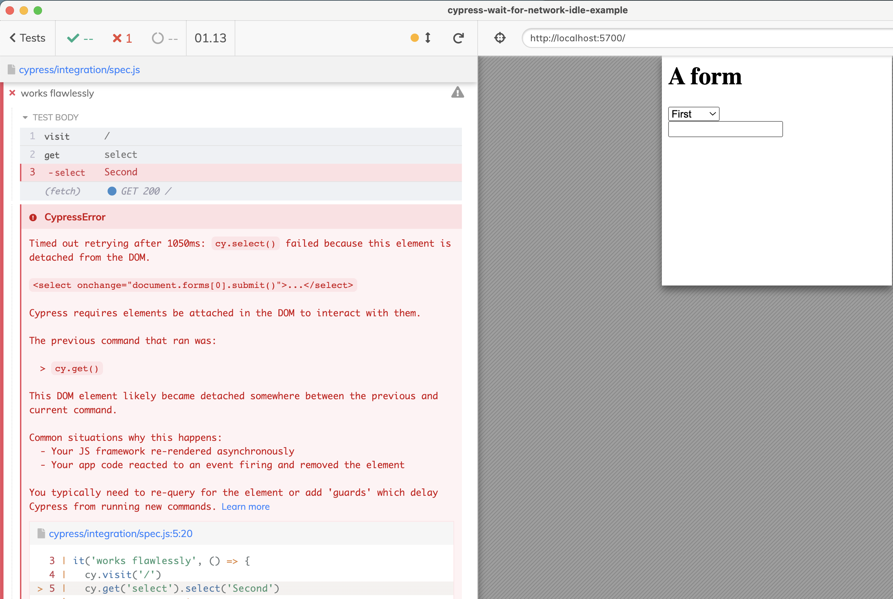

# cypress-wait-for-network-idle-example

> Example application showing Cypress test flake. Tests are stable by using [cypress-network-idle](https://github.com/bahmutov/cypress-network-idle) plugin

## Initial load flake

When the page loads, it requests some resources using `fetch` and re-renders the UI. If the test does not wait for the requests and tries to use the DOM elements, it gets a "detached from DOM element" error

